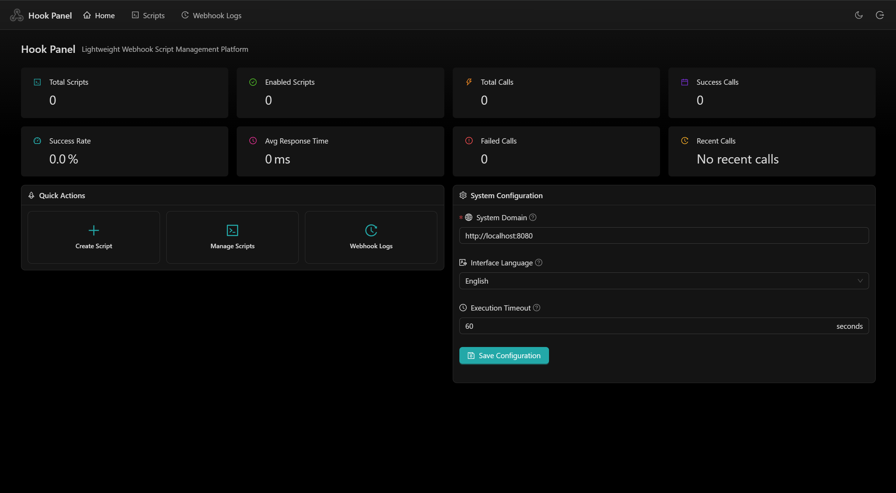
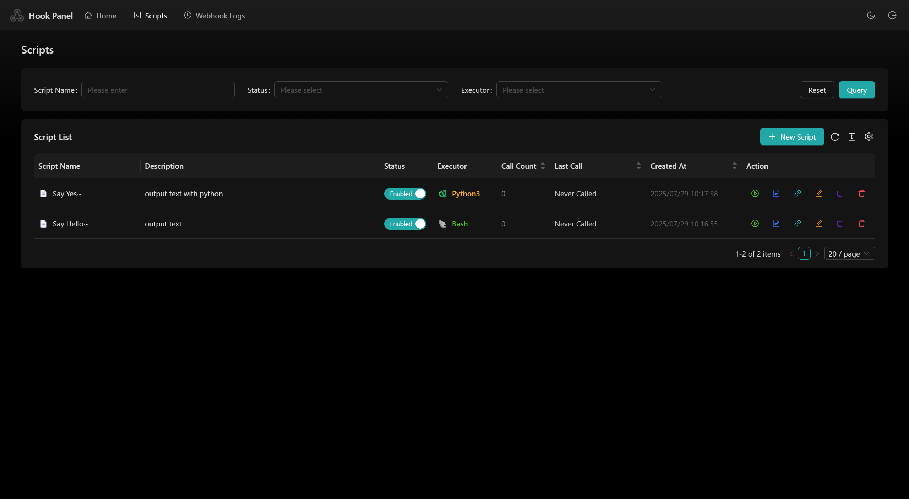
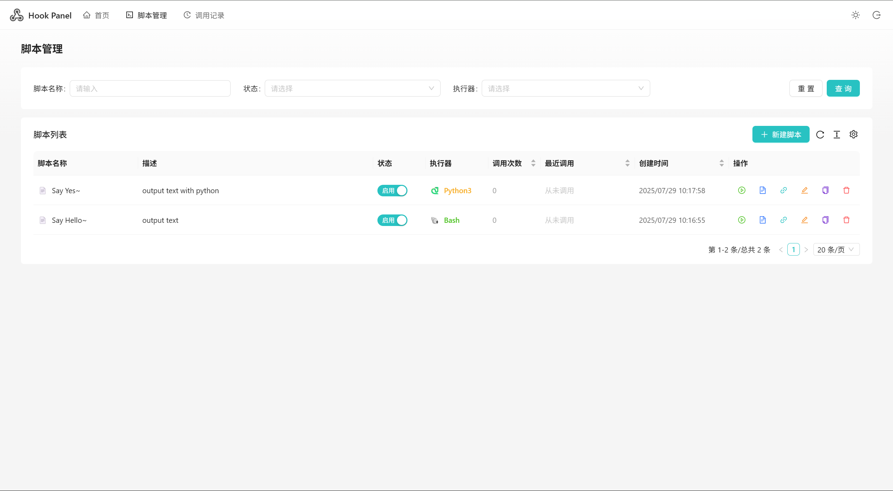

# Hook Panel 🎯

[中文文档](README_zh.md) | English

A lightweight Webhook management panel that supports script execution, logging, and system configuration.

## � Screenshots

<table>
  <tr>
    <td></td>
    <td></td>
  </tr>
  <tr>
    <td></td>
    <td></td>
  </tr>
</table>

## �🚀 Quick Start

### 1. Download Latest Release

#### Quick Download (Recommended)

**Linux x64:**
```bash
curl -L -o hook-panel.tar.gz https://github.com/slowlyo/hook-panel/releases/latest/download/hook-panel-linux-amd64.tar.gz && tar -xzf hook-panel.tar.gz && rm hook-panel.tar.gz
```

**Linux ARM64:**
```bash
curl -L -o hook-panel.tar.gz https://github.com/slowlyo/hook-panel/releases/latest/download/hook-panel-linux-arm64.tar.gz && tar -xzf hook-panel.tar.gz && rm hook-panel.tar.gz
```

#### Manual Download

Visit the [GitHub Releases](https://github.com/slowlyo/hook-panel/releases/latest) page to download the corresponding archive:

- **Linux (x64)**: `hook-panel-linux-amd64.tar.gz`
- **Linux (ARM64)**: `hook-panel-linux-arm64.tar.gz`

Extract the archive after downloading.

### 2. Run the Program

```bash
# Add execute permission
chmod +x hook-panel

# Default startup (port 8080)
./hook-panel

# Custom port startup
./hook-panel --port 3000
# Or use shorthand
./hook-panel -p 3000
```

### 3. Access the Panel

After the program starts, visit in your browser: `http://localhost:8080`

**Note**: When starting with a custom port, the system will automatically set the domain configuration to `http://localhost:port` for generating correct Webhook URLs.

## ✨ Key Features

- 🎯 **Webhook Management**: Create and manage Webhook endpoints with script execution support
- 📝 **Script Editing**: Built-in code editor supporting Shell, Python, Node.js and other scripts
- 📊 **Real-time Logs**: View Webhook execution logs and results
- ⚙️ **System Configuration**: Custom domain and timeout settings
- 🔐 **Security Authentication**: Bearer Token authentication to protect management interfaces
- 🌙 **Theme Switching**: Support for light and dark theme switching

## 🔧 Configuration

### Command Line Arguments

| Parameter | Short | Description | Example |
|-----------|-------|-------------|---------|
| --port | -p | Specify service port | `--port 3000` |
| --help | -h | Show help information | `--help` |

### System Configuration

After the program starts, you can configure it through the "System Configuration" page in the Web interface:

- **Domain Setting**: Used to generate Webhook URLs
- **Timeout**: Script execution timeout
- **Authentication Key**: Automatically generated on first startup, saved in `data/secret.key` file

## 📖 Usage Guide

### 1. First Access

- Open your browser and visit `http://localhost:8080`
- Login with the default key `your-secret-key` (recommended to change)

### 2. Create Webhook

1. Create a new script on the script management page
2. Write your script code (supports Shell, Python, Node.js, etc.)
3. Save and get the Webhook URL: `http://your-domain/h/{script-id}`

### 3. Call Webhook

```bash
# GET request (signature via query parameter)
curl "http://localhost:8080/h/your-script-id?signature=your-signature"

# POST request (signature via Header)
curl -X POST \
     -H "X-Signature: your-signature" \
     -H "Content-Type: application/json" \
     -d '{"key": "value"}' \
     http://localhost:8080/h/your-script-id
```

### 4. View Logs

On the Webhook logs page, you can view:
- Execution time and status
- Request parameters and response results
- Script output and error information

## 🔐 Security

- **Authentication Key**: Automatically generates a random key on first startup, saved in `data/secret.key` file
- **Key Management**: You can regenerate a new key by deleting the `data/secret.key` file
- **Webhook Signature**: Supports signature verification to ensure trusted request sources
- **Access Control**: Management interfaces require Bearer Token authentication

## 🛠 Troubleshooting

### Common Issues

1. **Port occupied**: Use the `-p` parameter to specify another port
2. **Insufficient permissions**: Ensure the file has execute permissions (`chmod +x hook-panel`)
3. **Script execution failure**: Check script syntax and system environment dependencies

### Health Check

```bash
# Check service status (no authentication required)
curl http://localhost:8080/health
```

## 📄 License

This project is licensed under the MIT License. See the [LICENSE](LICENSE) file for details.
